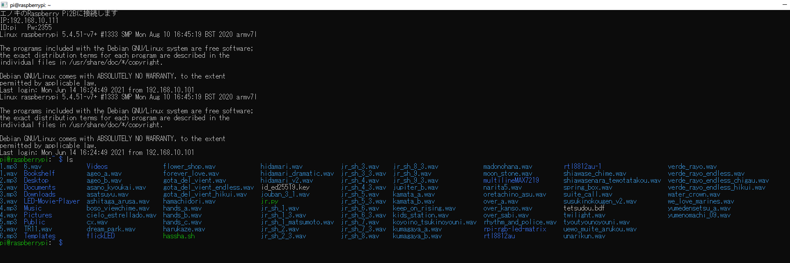

# About jr_hassha
Hey guys! We have a gift for you!  
This is able to play Japan Railway Hassha Melody.  
It use raspberry pi or other linux.  
This program is written by Bash language.  
You can change GPIO pins.  

# How to USE
1. Download
2. chmod +x ./hassha.sh
3. Connect hassha bell switch GPIO21 and 3v3 pin.
4. ./hassha.sh melody.wav voice.wav  

Caution: This isn't include *.wav files. Please make yourself.
  
# Sample commands
* OK Pattern
* * $./hassha.sh flower_shop.wav 1.wav
* * $./hassha.sh hidamari.wav 4.wav
* * $sudo ./hassha.sh gota_del_vient.wav 6.wav

* NG Pattern
* * $hassha.sh flower_shop.wav 1.wav
* * $./hassha flower_shop 1
* * $./hassha.sh flower_shop.wav default

# Music available
* melody.wav
* * Example: JR-SH1, Kogen, Haru, Hidamari other...
* * Caution: This available *.wav files only
* voice.wav
* * Example: Voice sound, "Ichibansen, door ga shimarimasu. Gochui kudasai."
* * Caution: This available *.wav files only

# Sample Video
Please click image. (Jump to YouTube)  

